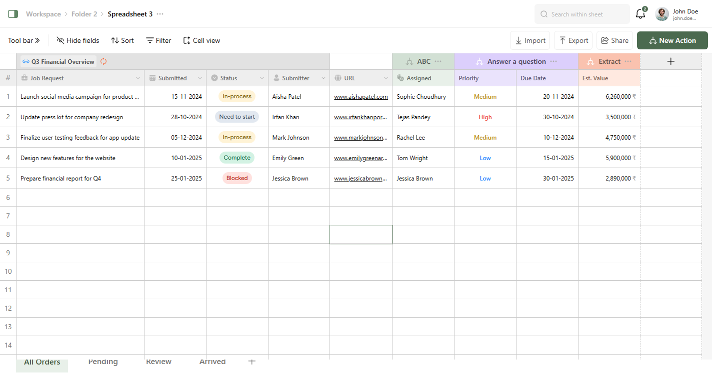

# Spreadsheet Prototype

A front-end prototype of a spreadsheet interface built with React, TypeScript, and TanStack Table. The application features a dynamic grid with column resizing, keyboard navigation, and data filtering capabilities.

## Key Features

- **Interactive Grid:** A spreadsheet grid powered by TanStack Table v8.
- **Dynamic Rows:** The grid generates empty rows to fill the available viewport height.
- **Cell Selection & Navigation:** Full cell selection via mouse click and navigation with keyboard arrow keys.
- **Column Resizing:** Draggable column headers for width adjustment.
- **Interactive Controls:** Features a collapsible toolbar and data filtering via footer tabs.

## Tech Stack

- **Framework:** React 18 (with Vite)
- **Language:** TypeScript (Strict Mode)
- **Styling:** Tailwind CSS (v4)
- **Table/Grid:** TanStack Table v8
- **Linting & Formatting:** ESLint + Prettier
- **Pre-commit Hooks:** Husky

## Setup

To get this project running locally:

1.  **Clone the repository:**
    ```bash
    git clone https://github.com/Shaimaa01/spreadsheet.git
    ```
2.  **Navigate to the project directory:**
    ```bash
    cd spreadsheet
    ```
3.  **Install dependencies:**
    ```bash
    npm install
    ```
4.  **Run the development server:**
    ```bash
    npm run dev
    ```

## Screenshots



---

## Trade-offs and Decisions

- **Custom Font for UI Elements:** The `Figtree` font was used for notification badges to solve inconsistent vertical alignment issues present in standard system fonts. This ensures visual correctness for small, centered text without requiring CSS hacks.
- **ESLint `exhaustive-deps` Override:** The ESLint warning for the `useMemo` hook that calculates column sizes was intentionally disabled. Using the linter's suggested dependencies caused significant performance issues during column resizing. The current implementation is more performant, and disabling the rule for this specific case was a deliberate choice.
